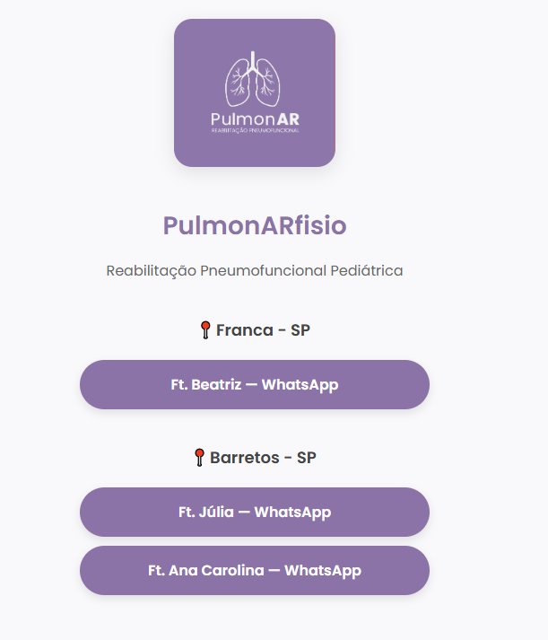

# 🌬️ PulmonARfisio Links

Página de links personalizada da **PulmonARfisio**, especializada em **Reabilitação Pneumofuncional Pediátrica**.  
Este projeto é uma alternativa leve e totalmente personalizável ao Linktree, com **exibição inteligente de links por horário** e foco em acessibilidade.

---

## 📌 Funcionalidades

- ✅ Visual limpo, responsivo e moderno  
- ✅ Fonte arredondada e amigável (Google Fonts – *Poppins*)  
- ✅ Agrupamento de contatos por cidade (Franca e Barretos – SP)  
- ✅ **Links dinâmicos**: exibidos de acordo com regras de horário pré-definidas no código  
- ✅ Código 100% estático (HTML, CSS e JavaScript leve)  
- ✅ Pronto para hospedar no GitHub Pages, Vercel, Netlify ou servidor próprio  

---

## 🖼️ Layout



---

## 🚀 Como usar

1. Clone o repositório:
   ```bash
   git clone https://github.com/seuusuario/pulmonarfisio-links.git

2. Substitua a imagem `logo.png` pela logo oficial da clínica/serviço.

3. Edite os links de WhatsApp para os contatos corretos.

4. (Opcional) Ajuste os horários de exibição de cada botão no trecho de JavaScript no final do HTML.

5. Hospede em qualquer plataforma de hospedagem estática:
   - GitHub Pages
   - Vercel
   - Netlify
   - Seu próprio servidor

---

## 💡 Tecnologias utilizadas

- HTML5  
- CSS3  
- JavaScript (nativo)  
- Google Fonts (Poppins)  

---

## 🛠️ Hospedagem recomendada

- [GitHub Pages](https://pages.github.com/)  
- [Vercel](https://vercel.com/)  
- [Netlify](https://www.netlify.com/)  

---

## 📄 Licença

Este projeto é de uso livre para fins educativos, pessoais ou profissionais.  
Sinta-se à vontade para adaptar, personalizar e expandir conforme necessário.

---

## 🙋‍♀️ Sobre

Este projeto foi desenvolvido para facilitar o acesso rápido aos contatos da equipe **PulmonARfisio**, com foco em atendimento humanizado, pediatria e reabilitação pneumofuncional.
